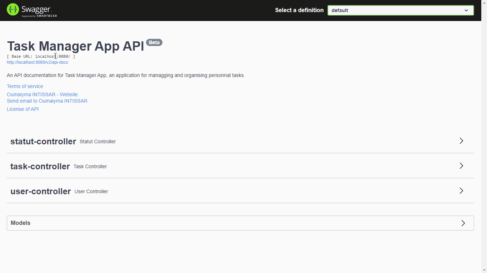

# Task Manager (V. Beta)

In this project, I was able to create a REST API in order to communicate with front-end applications.

The main feature of this application is to manage my personnal tasks.

## Author

- [@OumaIntissar](https://www.github.com/OumaIntissar)

## Demo

I documented this API using swagger, as shown bellow.

NB : You can access this interface via http://localhost:8080/swagger-ui/ after running the project locally.

- API endpoints overview

- Statut controller endpoints (Sample)

## Run Locally

In order to run this project locally, you must :

- Have JDK 1.8 installed
- Have Tomcat installed
- Clone the project into your local machine
- Open you IDE (Eclipse, intellij, ...)
- Then simply run the project 🤩

## Tech Stack

- Java/JEE
- Spring boot
- Spring Data JPA/Hibernate
- Spring REST API
- Swagger
- Lombok
- JUnit5
- MySql
- Maven
- Intellij IDEA

## Related

Please find via this link the front-end part made with Angular

[Task Manager Front-end](https://github.com/OumaIntissar/Task-management-front-end)

## Feedback

If you have any feedback, please reach out to me at oumaiymaintissar@gmail.com

